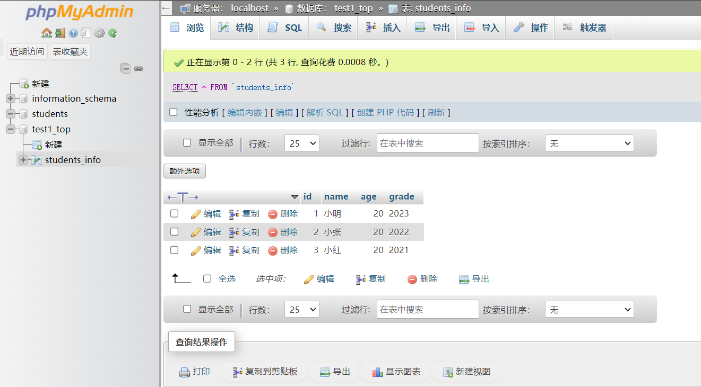
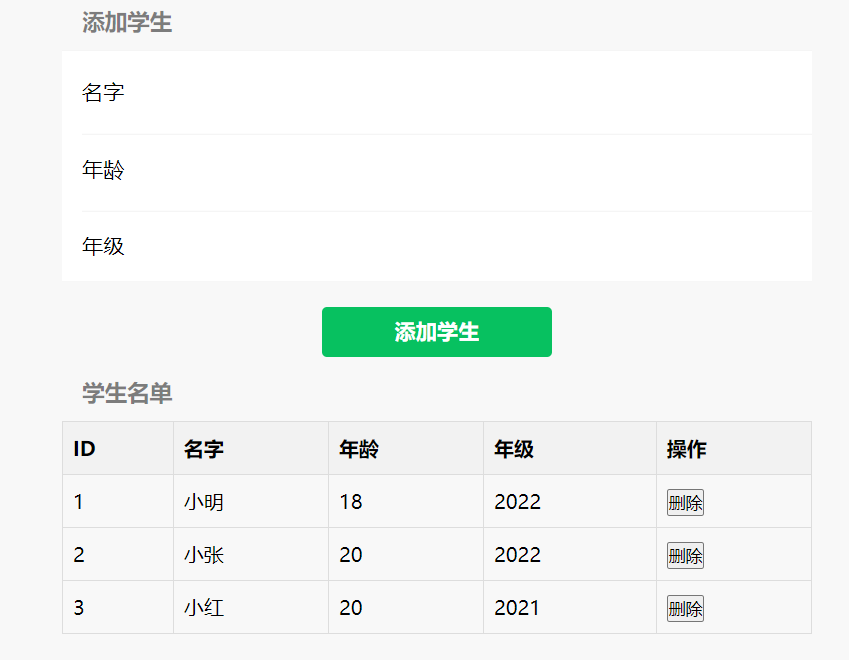

### 环境

系统:CentOS 8.5.2111 x86_64(Py3.7.9)

面板:宝塔面板

数据库:MySQL 5.7.40

PHP:8.0

### 其他

```php
$servername = "localhost";  	// 你的数据库服务器地址
$username = "test1_top";        // 你的数据库用户名
$password = "test1_top";        // 你的数据库密码
$dbname = "test1_top";          // 数据库名，与之前创建的数据库名相同
```

### MySQL命令

```mysql
-- 创建名为 students 的数据库
CREATE DATABASE IF NOT EXISTS students;

-- 切换到 students 数据库
USE students;

-- 创建名为 students_info 的表
CREATE TABLE IF NOT EXISTS students_info (
    id INT AUTO_INCREMENT PRIMARY KEY,
    name VARCHAR(255) NOT NULL,
    age INT NOT NULL,
    grade VARCHAR(50) NOT NULL
);
```

在 phpMyAdmin 中执行 SQL 命令可以通过以下步骤进行：

1. 打开 phpMyAdmin，并登录到你的数据库服务器。
2. 在左侧导航栏中选择你要操作的数据库，如果不存在，可以通过“数据库”选项卡创建一个新数据库。
3. 在上方的菜单中选择“SQL”选项卡。
4. 在 SQL 查询编辑框中，将要执行的 SQL 语句粘贴进去。
5. 单击执行按钮（可能是一个闪电图标或一个按钮上有“Go”或“执行”的文字）来运行 SQL 语句。

以下是具体步骤：

```mysql
CREATE DATABASE IF NOT EXISTS students;
```

- 在 phpMyAdmin 中，选择“SQL”选项卡。
- 将上述 SQL 语句粘贴到 SQL 查询编辑框中。
- 单击执行按钮。

### 切换到 students 数据库：

在 phpMyAdmin 中，通常你无需手动切换到数据库，因为你已经在左侧导航栏中选择了要操作的数据库。如果你选择了正确的数据库，就可以直接执行其他 SQL 命令。

### 创建名为 students_info 的表：

```mysql
CREATE TABLE IF NOT EXISTS students_info (
    id INT AUTO_INCREMENT PRIMARY KEY,
    name VARCHAR(255) NOT NULL,
    age INT NOT NULL,
    grade VARCHAR(50) NOT NULL
);
```

- 在 phpMyAdmin 中，选择“SQL”选项卡。
- 将上述 SQL 语句粘贴到 SQL 查询编辑框中。
- 单击执行按钮。

这样，你就可以在 phpMyAdmin 中创建数据库和表格。确保你有足够的权限执行这些操作。

在 MySQL 中，删除一个数据库的指令是`DROP DATABASE`。请谨慎使用这个命令，因为它会永久删除数据库及其所有内容。

```mysql
DROP DATABASE IF EXISTS students;
```

这个 SQL 语句会删除名为 `students` 的数据库，但是它仅在存在时才执行删除操作，以防止误操作。在执行这个命令之前，请确保你已经备份了数据库，因为这个操作是不可逆的。

### MySQL命令添加学生

如果你想通过数据库命令手动创建一条学生信息，可以使用 SQL 的 INSERT INTO 语句。在你的情况下，可以这样：

```mysql
INSERT INTO students_info (name, age, grade) VALUES ('小明', 18, '2022');
```

这个命令会在 `students_info` 表中插入一条记录，包括姓名为 '小明'，年龄为 18，年级为 '2022'。

### 遇到的问题

在典型的 MySQL 数据库中，AUTO_INCREMENT 列（比如你的 `id` 列）会自动递增。删除某一行并不会导致下一个插入的行的 ID 减少或重新更新。这是数据库的正常行为。

如果你希望在删除某一行后重新开始自动递增的 ID，可以考虑以下两种方法：

1. **使用 TRUNCATE TABLE**：

   使用 `TRUNCATE TABLE` 命令会删除表中的所有行，并重新设置 AUTO_INCREMENT 列的值：

   ```mysql
   TRUNCATE TABLE students_info;
   ```

   注意：`TRUNCATE TABLE` 会删除整个表，包括表的结构，因此在使用时请小心谨慎。

2. **手动重置 AUTO_INCREMENT**：

   你也可以使用以下 SQL 语句手动设置 AUTO_INCREMENT 列的值：

   ```mysql
   ALTER TABLE students_info AUTO_INCREMENT = 1;
   ```

   这将使下一个插入的行的 ID 从 1 开始。

   请注意，在实际应用中，通常不建议频繁地重置 AUTO_INCREMENT 值，因为这可能导致一些问题，尤其是在多用户环境中。ID 的递增是数据库用于唯一标识每一行的重要机制。

**当遇到“Access denied”错误时，可以按照以下步骤来解决：**<font color=red>\#1044 - Access denied for user 'test1_top'@'localhost' to database 'students'</font>

1. **使用合适的用户登录MySQL服务器：**

   ```bash
   mysql -u root -p
   ```
   这将提示你输入MySQL root用户的密码。输入密码后，你将进入MySQL的命令行界面。

2. **检查用户是否存在：**

   在MySQL命令行中执行以下查询，确保用户 'test1_top' 是否存在：

   ```sql
   SELECT User, Host FROM mysql.user WHERE User = 'test1_top';
   ```

   如果用户不存在，你需要创建该用户：

   ```sql
   CREATE USER 'test1_top'@'localhost' IDENTIFIED BY 'your_password';
   ```

   替换 'your_password' 为实际的密码。

3. **授予权限：**

   确保用户 'test1_top' 具有访问 'students' 数据库的权限：

   ```sql
   GRANT ALL PRIVILEGES ON students.* TO 'test1_top'@'localhost';
   ```

   如果你需要允许远程连接，可以使用 '%' 代替 'localhost'：

   ```sql
   GRANT ALL PRIVILEGES ON students.* TO 'test1_top'@'%';
   ```

   注意： '%' 允许用户从任何主机连接，只有在安全性允许的情况下使用。

4. **刷新权限：**

   在MySQL命令行中执行以下命令来刷新权限：

   ```sql
   FLUSH PRIVILEGES;
   ```

   这样做将使最新的权限更改立即生效。

5. **退出MySQL命令行：**

   ```sql
   exit;
   ```

   这将退出MySQL命令行。

现在，你应该能够使用用户 'test1_top' 访问 'students' 数据库了。

### 效果图





包括两种(学生添加/删除成功)

